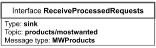

# Projeto de componentização: Marketplace
## Equipe 1
> Bernardo Fonseca Andrade de Carvalho  
> Hélio De Rosa Junior  
> José Octavio Vitoriano Martines Penna  
> Pablo Gabriel Rodrigues Neves Bedoya  
> Rodrigo Leonel Sartorato  
# Nível 1

## Diagramas Gerais do Nível 1

## Diagrama do Processo de Compra

## Diagrama do Processo de Distribuição de Ofertas

> O diagrama escolhido para análise foi o **Diagrama do Processo de Distribuição de Ofertas**. 

## Detalhamento dos Componentes:

**Componente OfferDistribution**
> Papel: O componente `OfferDistribution` recebe a lista de produtos mais desejados pelos clientes do Marketplace por meio da assinatura do tópico `products/mostwanted`, presente na interface `ReceiveProcessedRequests`. Ele ainda possui a responsabilidade enviar a mensagem de ofertas aos clientes através do tópico `campaign/campaignId/provideoffers` na interface `ProvideRankedOffers`. Por fim, por meio da interface `ReceiveOffer`, o componente assina o tópico `campaign/+/makeoffer/+` para receber as ofertas enviadas pelas lojas.

## Interfaces:
> ReceiveProcessedRequests 
> ProvideRankedOffers 
> ReceiveOffer 

## Detalhamento das Interfaces

**Inteface ReceiveProcessedRequests**

> Papel: Interface que lê do barramento a lista de produtos mais desejados da {última quinzena}, juntamente com a lista de customers interessados por pelo menos ⅓ dos produtos listados.

> Mensagem JSON utilizada na interface:

**MWProducts**
~~~json
{
    customers: [
        customerId: string
    ],
    products: [
        productId: string
    ]
}
~~~

**Inteface ProvideRankedOffers**

> Papel: Interface que envia vetor de offers para barramento (e.g. informação alimenta serviço de e-mail).

> Mensagem JSON utilizada na interface:

**OnSales**
~~~json
{
    customers: [
        customerId: string
    ],
    products: [
        {
         productId: string
         store: {
             storeId: string,
             inStock: number,
             salesPrice: number

         }
        }
    ],
    endDate: date
}
~~~

**Inteface ReceiveOffer**

> Papel: Interface que lê a offer do barramento, recebendo uma oferta de desconto das stores{n}.

> Mensagem JSON utilizada na interface:

**Offer**
~~~json
{
    storeId: string,
    productId: string,
    salesPrice: number,
    inStock: number
}
~~~

**Componente Store**
> Papel: O componente `Store` assina o tópico `campaign/+/notification`, presente na interface `CampaignEngage`, com o objetivo de receber informações sobre a campanha de ofertas vigente. Esse componente ainda é responsável por publicar ofertas de produtos através do tópico `capaign/+/makeoffer/+` na interface `MakeOffer`.

## Interfaces:
> CampaignEngage 
> MakeOffer 

## Detalhamento das Interfaces

**Inteface CampaignEngage**

> Papel: Interface que escuta o barramento a fim de identificar a campanha corrente.

> Mensagem JSON utilizada na interface:

**Campaign**
~~~json
{
    campaignId: string,
    campaignName: string,
    campaignURL: string,
    startDay: date,
    daysOfDuration: number
}
~~~

**Inteface MakeOffer**

> Papel: Interface que envia offer para o barramento quando é lançada uma oferta de produto.

> Mensagem JSON utilizada na interface:

**Offer**
~~~json
{
    storeId: string,
    productId: string,
    salesPrice: number,
    inStock: number
}
~~~

# Nível 2

## Diagrama do Nível 2

## Detalhamento de interação de componentes
* O componente `OfferDistribution` assina o barramento de mensagens de tópico `products/mostwanted` através da interface `ReceiveProcessedRequests`
	* Através da mensagem de tópico `products/mostwanted`, que chega na interface requerida `IRequest` do componente interno `ExtractProductList`, o componente `OfferDistribution` recebe uma lista que contém o array produtos mais desejados pelos clientes do Marketplace, juntamente com um array de clientes que marcaram como desejados pelo menos ⅓ dos produtos presentes na lista. Tal lista é filtrada para a última quinzena
* Então, tal evento é atendido por uma interface provida do componente `ExtractProductList`.
* O componente `ExtractProductList` separa os arrays de produtos e clientes, os fornece em duas interfaces providas `IRequestProductList` e `IRequestCustomerList`
	* A lista de produtos fornecida pela interface `IRequestProductList` é enviada para o componente `RankOffersBasedOnReference`, e neste componente, é usada como lista de referência para o ranqueamento de ofertas de lojas para operações em IA. 
	* A lista de clientes fornecida pela interface `IRequestCustomerList` é enviada para o componente `AssembleOnSales` que montará mensagens do tipo `OnSale`, que serão enviadas para o barramento com o tópico `campaign/{campaignId}/provideoffers`.
* O componente `OfferDistribution` também assina o barramento de mensagens de tópico `campaign/+/makeoffer/+` através da interface `ReceiveOffer`
	* Através da mensagem de tópico `campaign/+/makeoffer/+`, que chega na interface requerida `IOffer` do componente interno `ProcessStoreOffer`, o componente `OfferDistribution` recebe cada uma das ofertas, no tipo de mensagem `Offer`, feitas pelas lojas que escrevem no barramento através do tópico `campaign/{campaignId}/makeoffer/{offerId}`.
* Esse evento faz com o componente `ProcessStoreOffer`, monte/agrupe um array produtos em oferta, monte/agrupe um array que contém dados das lojas ofertantes, e separe os dados da campanha, e os forneça respectivamente nas interfaces: `IOfferProductList`, `IOfferStoreDataList` e `IOfferCapaignDataList`.
	* O array de produtos em oferta é enviado para o componente `RankOffersBasedOnReference`, através da interface provida `IOfferProductList` para que alimente as operações de IA mencionadas anteriormente.
* O array de informação das lojas ofertantes e os dados da campanha são enviados para o componente `AssembleOnSales`, para que sejam incorporados nas mensagens do tipo `OnSales` como dito anteriormente
* A lista de produtos separados/rankeados pelo componente `RankOfferBasedOnReference` também é enviado para o componente `AssembleOnSales`, para que também seja acrescentado à mensagem do tipo `OnSale`
* Por fim, o componente `AssembleOnSales`, finaliza a montagem da mensagem do tipo `OnSale` e a escreve no barramento através do tópico `campaign/+/provideoffers`, na interface `ProvideRankedOffers`.

## Detalhamento dos Componentes:

**Componente ExtractProductsList** 
> Papel: é responsável por receber a lista de produtos pré-processada pelo componente `ProcessCustomerRequests` e separar tal lista em um array de produtos pré-selecionados e em um array de clientes que assinalaram interesse em pelo menos ⅓ da lista de produtos previamente mencionada. 

## Interfaces:
> IRequest 
> IRequestCustomerList 
> IRequestProductList 

## Detalhamento das Interfaces

**Inteface IRequest** 

> Papel: Interface requerida que pede por dados de produtos e clientes na forma de lista.

Método | Objetivo
-------| --------
`getProcessedRequests` | `pede por uma lista de dados pré-processados`.

**Inteface IRequestProductList** 

> Papel: Interface provida que fornece um array de produtos, para que seja usado como array de referência.

Método | Objetivo
-------| --------
`getProductList` | `fornece um array de produtos`.

**Inteface IRequestCustomerList** 

> Papel: Interface provida que fornece um array de customeId, para que seja usado na montagem de mensagens de campanhas de desconto. 

Método | Objetivo
-------| --------
`getCustomerList` | `fornece um array de produtos`.

**Componente ProcessStoreOffer** 
> Papel: é responsável por processar cada uma das ofertas feitas por lojas, e separar e agrupar/destacar os produtos, dados da loja e dados da campanha contidos nas ofertas.

## Interfaces:
> IOffer 
> IOfferProductList 
> IOfferStoreDataList 
> IOfferCampaignDataList 

## Detalhamento das Interfaces
**Inteface IOffer** 

> Papel: Interface requerida que pede por ofertas de cada loja.

Método | Objetivo
-------| --------
`requestOffer` | `pede por uma oferta de um lojista`.

**Inteface IOfferProductList** 

> Papel: Interface provida que fornece a lista de produtos ofertados por `n` lojas.

Método | Objetivo
-------| --------
`getOfferProductList` | `fornece uma lista de produtos ofertados pelas lojas`.

**Inteface IOfferStoreDataList** 

> Papel: Interface provida que fornece a lista de dados referente às lojas.

Método | Objetivo
-------| --------
`getOfferStoreIdList` | `fornece uma lista que contém strings compostas por id da loja storeId, número de unidades inStock do produto e valor com desconto ofertado salesPrice`

**Inteface IOfferCampaignDataList** 

> Papel: Interface provida que fornece a data final da campanha.

Método | Objetivo
-------| --------
`getOfferCampaignEndDate` | `fornece a data de término endDate da campanha`.

**Componente RankOffersBasedOnReference** 
> Papel: é responsável fornecer uma lista de ofertas ranqueadas, de acordo com operações de IA .

## Interfaces:
> IRankedProducts 

## Detalhamento das Interfaces

**Inteface IRankedProducts** 

> Papel: Interface provida que fornece a lista final de produtos rankeados por IA.

Método | Objetivo
-------| --------
`getRankedProductsList` | `fornece uma lista de produtos ranqueados por operações de IA (e.g. opereções com base em Support-vector Machine ou Logistic Regression)`.

**Componente AssembleOnSales** 
> Papel: é responsável fornecer a mensagens de campanha de ofertas que será recebida por clientes.

## Interfaces:
> ProvideRankedOffers 

## Detalhamento das Interfaces

**Inteface ProvideRankedOffers** 

> Papel: Interface provida que fornece a mensagem final que será enviada aos clientes.

Método | Objetivo
-------| --------
`getRankedOffers` | `fornece a mensagem final que será escrita no barramento para que os clientes as possam consumir`.

## Diagrama do Nível 3

> Protótipo no MIT APP Inventor:

> Diagrama Referente ao Protótipo:

### Detalhamento da interação de componentes

* O componente GetProductsCampaignList recebe os produtos passíveis de receberem ofertas por lojistas cadastrados no marketplace. Ele disponibiliza os produtos obtidos através da interface IProductsCampaignList.

* O componente ComputeProductData é responsável por ler os produtos recebidos e gerar modelos compatíveis com os componentes da GUI. Ele ainda inicia o evento que irá listar os produtos disponíveis para oferta na interface gráfica. Além disso, esse componente permite que se pesquise por um produto, por categoria ou palavra-chave, retornando os modelos que correspondam aos critérios de busca.

* O componente ProductComponent é o responsável por exibir as informações dos produtos. Além disso, ele possui componentes internos que permitem receber os inputs necessários para que o lojista realize uma oferta, sendo eles o valor e a quantidade de produtos. Este componente possui ainda um botão como componente interno, que dispara o evento de envio de oferta.

* O evento de envio de oferta é recebido pelo componente SendOffer, que receberá os dados inputados pelo lojista, relacionado com a sua oferta. Além disso, para que a oferta seja criada, é necessário que esse componente busque as informações do lojista autenticado, utilizando a interface provida pelo componente GetUserInfo. Após a obtenção dos dados do lojista autenticado e dos inputs da oferta, o componente é reponsável por publicar a oferta no barramento, enviando uma mensagem do tipo 'offer' para o tópico 'campaign/+/makeoffer/+'

* Tem-se ainda o componente GetUserInfo que recebe as informações do usuário lojista autenticado de um componente externo. Essas informações são expostas através da interface IUserInfo, permitindo que o componente de envio de oferta (SendOffer), consuma esses dados para conseguir enviar uma oferta com sucesso.

* Por fim há ainda dois componentes na interface que permitem filtros da lista de produtos. O primeiro deles permite filtros por categoria e o segundo permite filtros por palavra-chave.